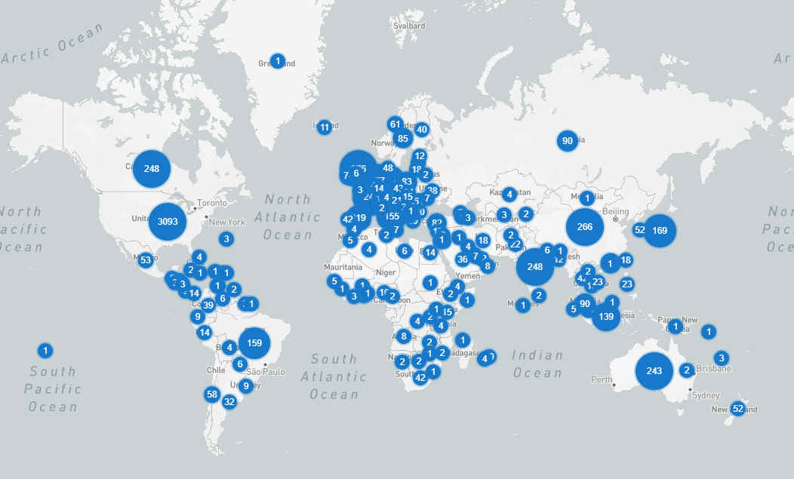

<!-- _class: centered -->

# Forum Aerospace Valley 2025
## Atelier Technique CSEC
##

---

# Titre et Thème

**Souveraineté et systèmes embarqués : enjeux et actions clés**

Souveraineté dans le domaine des systèmes embarqués : les menaces, les enjeux, les perspectives et les actions à mener à l'échelle de notre pôle."

---
# Axes
- Souveraineté et composants électroniques (HW , architecture)
- Souveraineté et IA (framework IA, *DeepGreen*,..)
- Souveraineté et données 
- Souveraineté et *Cloud computing*
- Souveraineté et systèmes
  - Domaine spatial : Lanceurs, Systèmes spatiaux (IRIS2)
- Souveraineté et formation 
- Souveraineté et rercherche académique

---
#  Structure (pour chaque axe)
- Constat 
  - Quelles sont les causes (règlementation, ressources, délocalisation, situation monopolistique, etc.)
  - Quels sont les enjeux de la souveraineté dans le domaine?
    - Quels sont les conséquence d'un manque de souveraineté?
    - Des faits, des observations...
  - Quelle est la situation actuelle à l'échelle de l'Europe, de la France,...)? Comment évolue-t-elle?
- Perspectives
  - Quelles sont les initiatives en cours pour accroître notre souveraineté?
  - Comment agir dans notre écosystème local? 
  - Quelles idées de projets pour améliorer notre souveraineté?

---
# Souveraineté et composants électroniques
## Constat

- Situation globale (voir le [rapport Saunier](https://www.senat.fr/rap/r07-417/r07-4171.pdf))

- Pénurie (voir article [Wikipedia](https://fr.wikipedia.org/wiki/P%C3%A9nurie_de_composants_%C3%A9lectroniques_de_2020-2023))
- La prolématique ITAR (ITAR, voir [ici](https://www.portail-ie.fr/univers/droit-et-intelligence-juridique/2019/jdr-norme-itar-lexposition-des-technologies-francaises-aux-restrictions-americaines/))
- Problèmes de propriété intellectuelle (IP)
- Problèmes liés à la sécurité (backdoors, le cas Huawei)
  
---
## Perspectives

- Fabrication
- Design 
  - L'initiative "RISC-V", la *European Processor Initiative* 

---
# Souveraineté et IA (framework IA, *DeepGreen*,..)
## Constat
*À compléter...*
## Perspectives
*À compléter...*

---
# Souveraineté et données 
## Constat
*À compléter...*
## Perspectives
*À compléter...*
   
---
# Souveraineté et systèmes
## Constat
*À compléter...*
## Perspectives
*À compléter...*
      
---
# Souveraineté et *cloud computing*
## Constat

   

 (de [www.datacentermap.com](https://www.datacentermap.com/datacenters/) 

## Perspectives

- L'initiative opencloud, *GAIA-X*

---
# Souveraineté et formation
## Constat
*À compléter*
## Perspectives
*À compléter*

---
# Souveraineté et recherche scientifique
## Constat
*À compléter*
## Perspectives
*À compléter*

